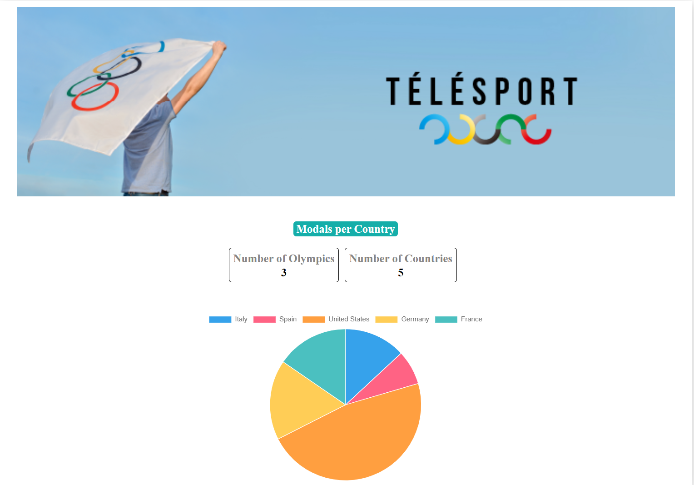
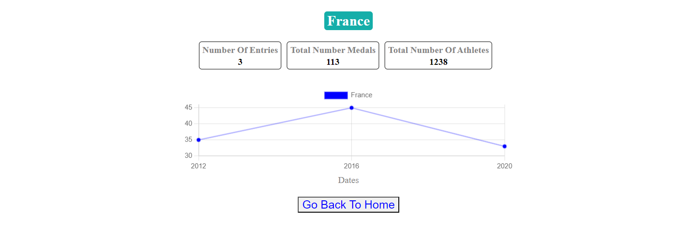

# OlympicGamesStarter

This project was generated with [Angular CLI](https://github.com/angular/angular-cli) version 14.1.3.
  (Note: You update the version before installing the `npm` packages)

## Getting Started

Before you begin, make sure to install the required dependencies by running `npm install`. 
  Additionally, install `chart.js` for graphics using the command `npm install chart.js`. 
  (Note: Ensure that Node.js is installed locally on your machine.)

## Development server

Run `ng serve` or `npm run start`for a development server. Navigate to `http://localhost:4200/`. The application will automatically reload if you change any of the source files.

## Build

Run `ng build` to build the project. The build artifacts will be stored in the `dist/` directory.

## 
Home Page: 

## Country Detail:
 